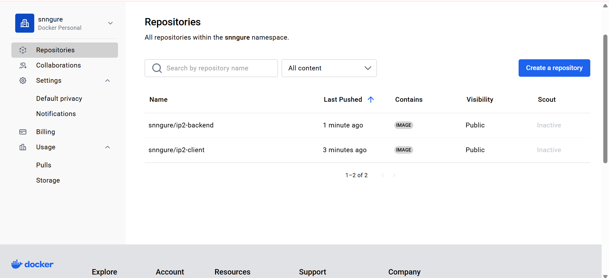

## where the docker images are hosted


# my docker compose file 
```yaml
# Use Docker Compose file format version 3.8.
# This specifies compatibility with newer Docker features and syntax.
version: "3.8"

# Define the multi-container application services.
services:

  # Define the frontend service, labeled 'client'.
  client:
    # The 'build' section specifies how to build the Docker image for the client.
    build:
      # 'context' tells Docker where to look for the Dockerfile and associated files.
      # Here, it will look inside the './client' directory relative to this file.
      context: ./client
      # Specifies the Dockerfile used to build the image. This allows custom naming if needed.
      dockerfile: Dockerfile
    # Names the built image. Useful for pushing to DockerHub or referencing locally.
    image: snngure/ip2-client:latest
    # Assigns a fixed container name for easier debugging and consistency.
    container_name: ip2-client
    # Maps the container's internal port 3000 (used by most React apps) to the host's port 3000.
    # This allows the developer or user to access the client app via localhost:3000.
    ports:
      - "3000:3000"
    # Specifies that the 'client' service should only start after the 'backend' is ready.
    # It does not wait for the backend to be "fully ready", just that the container is running.
    depends_on: 
      - backend
    # Connects this service to a custom Docker network called 'snnetwork'.
    networks:
      - snnetwork
    # Mounts a named volume called 'client_modules' at '/app/node_modules' inside the container.
    # This ensures node_modules is not overridden during bind-mounting the codebase in dev setups.
    volumes:
      - client_modules:/app/node_modules

  # Define the backend service, labeled 'backend'.
  backend:
    # Build configuration for the backend image.
    build:
      # Tells Docker to look inside the './backend' directory for build context.
      context: ./backend
      # Uses the specified Dockerfile inside the backend folder.
      dockerfile: Dockerfile
    # Names the Docker image for the backend. Can be pushed or reused.
    image: snngure/ip2-backend:latest
    # Assigns a fixed container name to make it easier to refer to in logs or exec commands.
    container_name: ip2-backend
    # Exposes the backend's internal port 5000 (commonly used by Express or Flask apps) to the host.
    ports:
      - "5000:5000"
    # Loads environment variables from a .env file located in the backend directory.
    # This is useful for storing sensitive values like API keys, database URLs, etc.
    env_file:
      - ./backend/.env
    # Connects this service to the same custom network as the client for inter-service communication.
    networks:
      - snnetwork
    # Mounts a named volume 'backend_modules' to persist or isolate node_modules in the container.
    volumes:
      - backend_modules:/app/node_modules

# Define custom Docker networks used by the services.
networks:
  # Declare a bridge network named 'snnetwork' for internal communication between services.
  snnetwork:
    name: snnetwork
    # 'bridge' is the default Docker network driver for local containers.
    # It allows the services to communicate with each other using container names.
    driver: bridge

# Define persistent named volumes used by the services to avoid overwriting node_modules.
volumes:
  # Volume for the client service's node_modules directory.
  client_modules:
  # Volume for the backend service's node_modules directory.
  backend_modules:
```
# my docker file (backend)
```Dockerfile
# Start from the official lightweight Node.js 16 image based on Alpine Linux
FROM node:16-alpine

# Set the working directory inside the container to /app
WORKDIR /app

# Copy only package.json and package-lock.json into the container 
# This allows Docker to cache installed dependencies between builds if package files don’t change
COPY package*.json ./

# Install production dependencies exactly as specified in package-lock.json
# npm ci is preferred for CI/CD and Docker because:
# - it’s faster than npm install
# - it does a clean install and ensures package-lock.json is strictly followed
RUN npm ci

# Copy the rest of the application source code into the container, this includes server.js and any other app files
COPY . .

# Expose port 5000 to the host machine so it knows which port the backend is listening on
EXPOSE 5000

# start the Node.js backend server by running server.js
CMD ["node", "server.js"]

```
# my docker file (client)
```Dockerfile
# Use the official lightweight Node.js 16 image (based on Alpine Linux) as the base image for the first stage
FROM node:16-alpine AS stage-one

# Set the working directory inside the container to /app
WORKDIR /app

# Copy package.json and package-lock.json into the container
COPY package*.json ./

# Install project dependencies exactly as specified in package-lock.json
# npm ci is faster and more reliable for production builds than npm install
RUN npm ci

# Copy the rest of the application’s source code into the container
COPY . .

# Build the app for production (typically creates an optimized static build in /build)
RUN npm run build


# Start a new stage with the same base Node.js 16 Alpine image for the final lightweight image
FROM node:16-alpine

# Set the working directory inside the container to /app
WORKDIR /app

# Install "serve" globally to serve the production build as a static site
RUN npm install -g serve

# Copy only the production build artifacts from the first stage into this final image
# This keeps the final image small and avoids including dev dependencies and source code
COPY --from=stage-one /app/build ./build

# Expose port 3000 so the container can accept connections on this port
EXPOSE 3000

# Define the command to run when the container starts:
# serve the static build folder on port 3000
CMD [ "serve", "-s", "build", "-l", "3000" ]

```
## How to run
<ol>
  <li><strong>Clone the Repository</strong>: First, clone the project repository to your local machine.</li>
  <li><strong>Navigate to Project Root</strong>: Open your terminal and change into the my-project/ directory. This is where the <code>docker-compose.yaml</code> file should be located.</li>
  <li> 
    Add Your MongoDB Connection String: (Create an <code>.env</code> file inside the backend)

    MONGO_URI=YOUR_CONNECTION_STRING
  </li>
  <li>
  Run Docker Compose: Execute the following command:

  bash
  docker compose up --build
  
  <ul>
    <li>
      <strong>up</strong>: This command starts the services defined in your docker-compose.yaml file.
    </li>
    <li>
      <strong>--build</strong>: This flag forces Docker Compose to rebuild the images for your backend and client services. This is crucial when you've made changes to your Dockerfiles or application code. You can omit this flag on subsequent runs if no Dockerfile or dependency changes have occurred.
    </li>
  </ul>
  </li>
</ol>